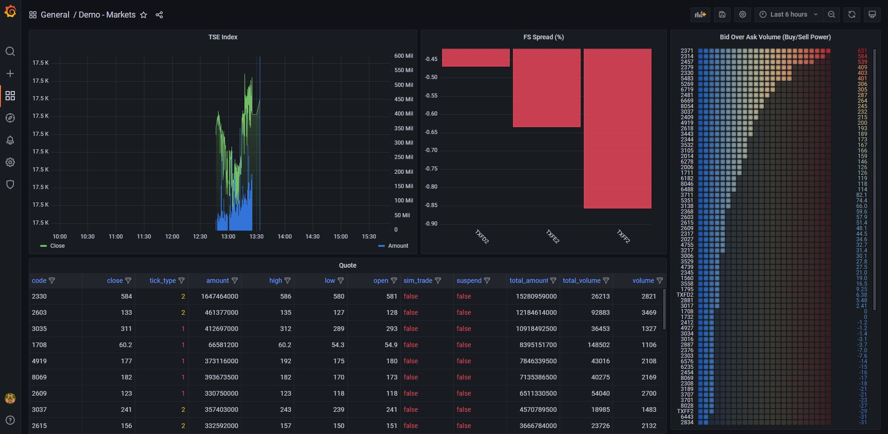
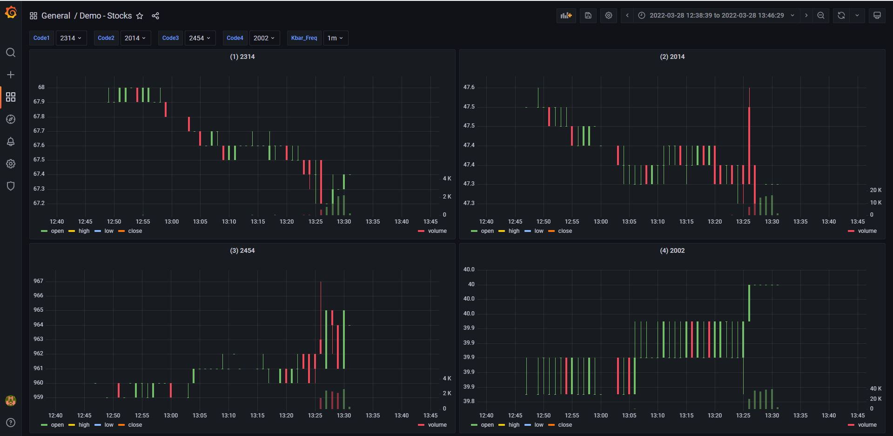

# TradeView

TradeView is a stock analysis & monitoring solution.


## Set up Grafana and InfluxDB

```bash
cd docker && docker-compose -p trade_view up -d
```

## Installation

```bash
pip install -r requirements.txt
```


## Examples

```bash
python app.py -m stream
```

```bash
python app.py -m schedule
```

```bash
http://localhost:3000
```

<p align="center">
    
</p>


<p align="center">
    
</p>
